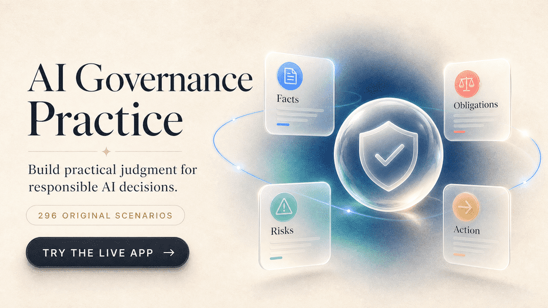

AI Governance Practice
Practice the judgment behind responsible AI decisions.
A visual, scenario-based study aid for people who want to get better at turning AI governance principles into practical action.

 

&nbsp;&nbsp;&nbsp;&nbsp;

 

 
Open the live app →

What is this?
AI governance is not just knowing the vocabulary. It is knowing what to notice, who is responsible, what could go wrong, and what to do next.

AI Governance Practice gives you realistic situations and asks you to make the call. You choose an answer, see the reasoning, and build a repeatable way of thinking that carries into real governance work.

296
4
0
original scenarios
governance passes
account required to start

A question is only the beginning

<strong>Open the interactive README tour</strong>

 
01 · NOTICE
02 · REASON
03 · CHOOSE
04 · LEARN
Read the situation without jumping to a framework.
Separate obligations from assumptions.
Pick the narrowest defensible response.
Review the rationale and carry the lesson forward.

<blockquote>
<strong>GitHub-native interaction:</strong> expand this panel, browse the visual cards below, and use the linked badges to jump into the live experience.
</blockquote>

The real app is intentionally calm and readable: one scenario, four answer choices, clear feedback, and enough explanation to understand why an answer is defensible. Progress begins in the browser, so visitors can start immediately without signing up.

The four-pass method
Every scenario can be read through the same four passes. This keeps the learner from jumping to a familiar framework before understanding the situation in front of them.

01 · Facts
02 · Obligations
03 · Risks
04 · Action
What is actually happening?
What is required, and by whom?
What could harm people or the organization?
What is the narrowest defensible next step?

What you can explore

<strong>Show the current practice map</strong>

 
Track signal
What it gives you
Foundations
Shared vocabulary, roles, accountability, and governance structure.
Laws & frameworks
A way to distinguish obligations, standards, and voluntary guidance.
Development
Questions about design choices, evaluation, controls, and risk reduction.
Deployment & use
Decisions about oversight, transparency, incidents, monitoring, and impact.

The current track contains 296 original scenarios across four areas:

Foundations of AI Governance
Laws, Standards, and Frameworks
Governing AI Development
Governing AI Deployment and Use

The content touches responsible AI, risk identification, accountability, transparency, explainability, human oversight, fairness, monitoring, incidents, lifecycle controls, and practical governance decisions. It is built for judgment—not rote memorization.

A little product sparkle
The app includes focused study sessions, domain practice, a review queue, progress tracking, and a timed practice sitting. It keeps the motivational layer deliberately light: a daily goal, a streak, and the satisfaction of getting better at the hard questions.

Small loop. Better judgment. Repeat.

The interface is mobile-first, works without an account, and can keep progress locally on the device. Optional sign-in adds synchronization across devices.

Original content
All questions, scenarios, rationales, and takeaways in this project are independently written educational material. They are not copied from certification examinations, proprietary question banks, or official training resources.

The project discusses public frameworks, standards, and regulations—including the NIST AI Risk Management Framework, the EU AI Act, and ISO/IEC 42001—only as subject matter for learning. Mentioning them does not imply affiliation, endorsement, certification, or formal compliance.

Study-aid disclaimer
This is a free supplemental study aid for professional development. It is not an official certification resource, course, training program, or substitute for primary preparation materials. It is not affiliated with or endorsed by any certification organization. It does not contain actual certification examination questions and does not guarantee examination success.

Try it locally
npm install
npm run dev

Then open localhost:3000. No environment variables are required for the core study experience.

Contributing
Found a bug? Have an accessibility improvement? Want to suggest an original governance scenario? Open an issue and describe what you noticed. Please do not submit recalled, copied, confidential, or proprietary examination material.

Project status
The live product is available at ai-governance-practice.vercel.app. The repository is being actively shaped as a public portfolio project, with new content and visual refinements added as the learning experience evolves.

Built to make governance judgment feel practiceable.
Start a scenario →

AI Governance Practice is an independent educational project. Framework and organization names belong to their respective owners.

